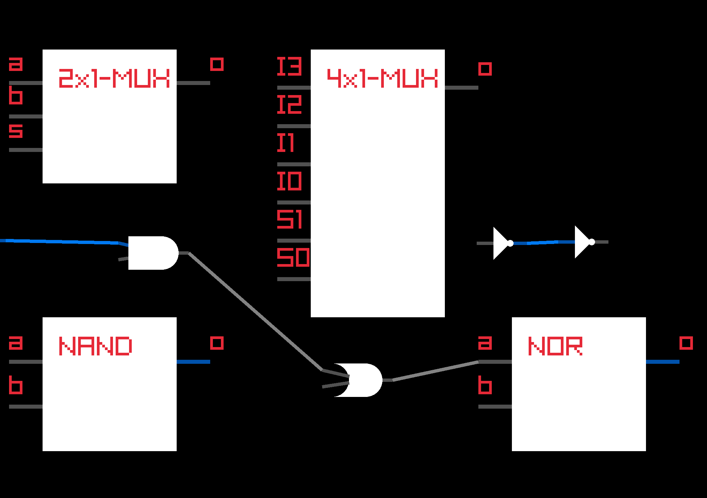

# HWEmu
C# hw emulator that allows user to place, emulate logic gates/chips and create new ones using UI or by writing truth tables.

# NAND.md

| a | b | → | o |
|---|---|---|---|
| 0 | 0 | → | 1 |
| 0 | 1 | → | 1 |
| 1 | 0 | → | 1 |
| 1 | 1 | → | 0 |